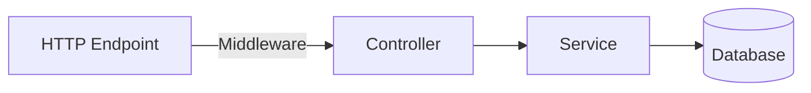

# EduTECH


[EduTech](https://edutech.vercel.app) is a MERN Full Stack project developed in the Make It Real Bootcamp.

## Stack

This project is structured in a monorepo enabled by yarn workspaces with the following stack:

#### Frontend:


#### Backend:


## Deployment

- Client: Vercel
- Server: Heroku
- Email API: SendGrid
- Image and Video Hosting: Cloudinary

## Requests Flow



## Development

```bash
# Clone the repository
git clone https://github.com/paolorossig/edu-tech.git
cd edu-tech
# Create your own feature branch
git checkout dev
git checkout -b feat/NAME
yarn install
# Then open a PR explaining your contribution
```
